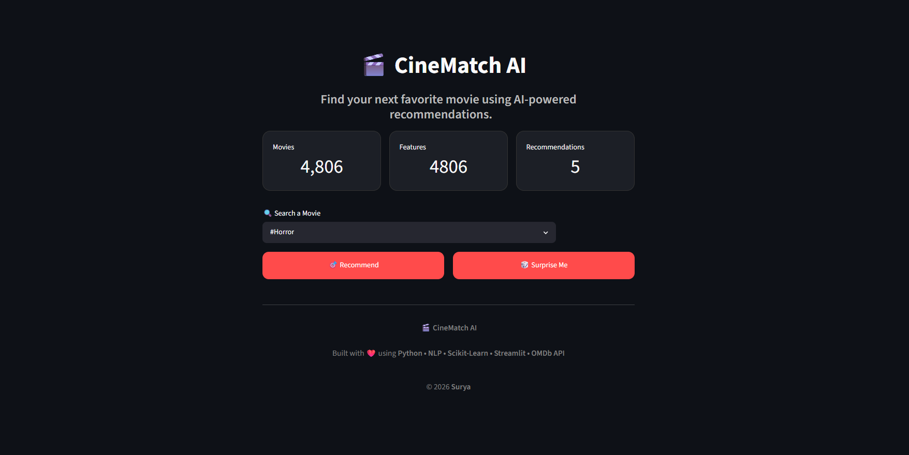
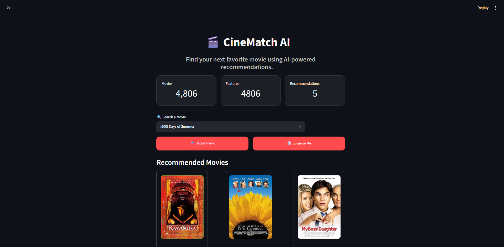
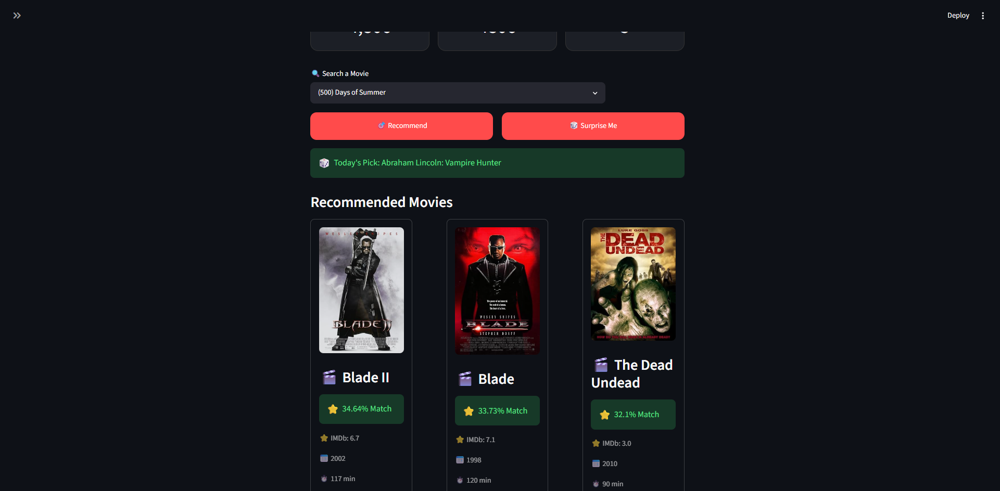

# 🎬 CineMatch AI

An AI-powered **Content-Based Movie Recommendation System** built using **Python, NLP, Scikit-Learn, Streamlit, and OMDb API**. The application recommends movies similar to a user's selection by analyzing genres, cast, director, keywords, and movie overviews using Natural Language Processing and Cosine Similarity.

---

## 🚀 Live Demo

*(Add your Streamlit deployment link here after deployment)*

```
https://your-app-name.streamlit.app
```

---

## 📸 Screenshots

### 🏠 Home Page




---

### 🎬 Movie Recommendations




---

### 🎲 Surprise Me Feature




---

## ✨ Features

- 🎬 Content-Based Movie Recommendation
- 🔍 Search from 4800+ Movies
- 🖼 Movie Posters using OMDb API
- ⭐ IMDb Ratings
- 📅 Release Year
- ⏱ Runtime Information
- 🎭 Genres
- 👥 Cast Information
- 🎬 Director Details
- 📝 Movie Plot
- 🎲 Surprise Me Feature
- ⚡ Fast Recommendations using Cosine Similarity
- 🌙 Modern Streamlit Interface

---

## 🛠 Tech Stack

### Programming Language

- Python

### Libraries

- Pandas
- NumPy
- Scikit-Learn
- NLTK
- Requests
- Streamlit

### Machine Learning

- Natural Language Processing (NLP)
- CountVectorizer
- Cosine Similarity

### API

- OMDb API

---

## 📂 Project Structure

```
CineMatch-AI/
│
├── app.py
├── recommendation.py
├── movie_recommender.ipynb
├── requirements.txt
├── README.md
│
├── data/
│   ├── movies.csv
│   └── credits.csv
│
├── model/
│   ├── movie_list.pkl
│   └── similarity.pkl
│
├── screenshots/
│
└── assets/
```

---

## ⚙️ How It Works

1. Load the movie and credits datasets.
2. Merge both datasets using the movie title.
3. Extract important features:
   - Genres
   - Keywords
   - Cast
   - Director
   - Movie Overview
4. Preprocess the text by:
   - Removing spaces where appropriate
   - Tokenization
   - Stemming using PorterStemmer
5. Combine all features into a single **tags** column.
6. Convert text into numerical vectors using **CountVectorizer**.
7. Compute similarity scores using **Cosine Similarity**.
8. Display the top five most similar movies in an interactive Streamlit interface.

---

## 🧠 Machine Learning Pipeline

```
Movie Dataset
      │
      ▼
Data Cleaning
      │
      ▼
Feature Engineering
      │
      ▼
Tags Creation
      │
      ▼
Text Preprocessing
      │
      ▼
CountVectorizer
      │
      ▼
Feature Vectors
      │
      ▼
Cosine Similarity
      │
      ▼
Top 5 Recommendations
```

---

## 💻 Installation

Clone the repository

```bash
git clone https://github.com/yourusername/CineMatch-AI.git
```

Navigate to the project directory

```bash
cd CineMatch-AI
```

Install the required packages

```bash
pip install -r requirements.txt
```

Run the application

```bash
streamlit run app.py
```

---

## 📊 Dataset

This project uses the **TMDB 5000 Movie Dataset**, which contains movie metadata such as genres, cast, crew, keywords, and overviews.

---

## 🎯 Future Improvements

- User Authentication
- Personalized Recommendations
- Collaborative Filtering
- Hybrid Recommendation System
- Movie Trailer Integration
- Watchlist Feature
- Genre-wise Recommendations
- Cloud Deployment

---

## 👨‍💻 Author

**Surya Vardhan Reddy**

GitHub: https://github.com/yourusername

LinkedIn: https://linkedin.com/in/yourprofile

---

## ⭐ Support

If you found this project helpful, consider giving it a ⭐ on GitHub.

It helps others discover the project and supports future improvements.